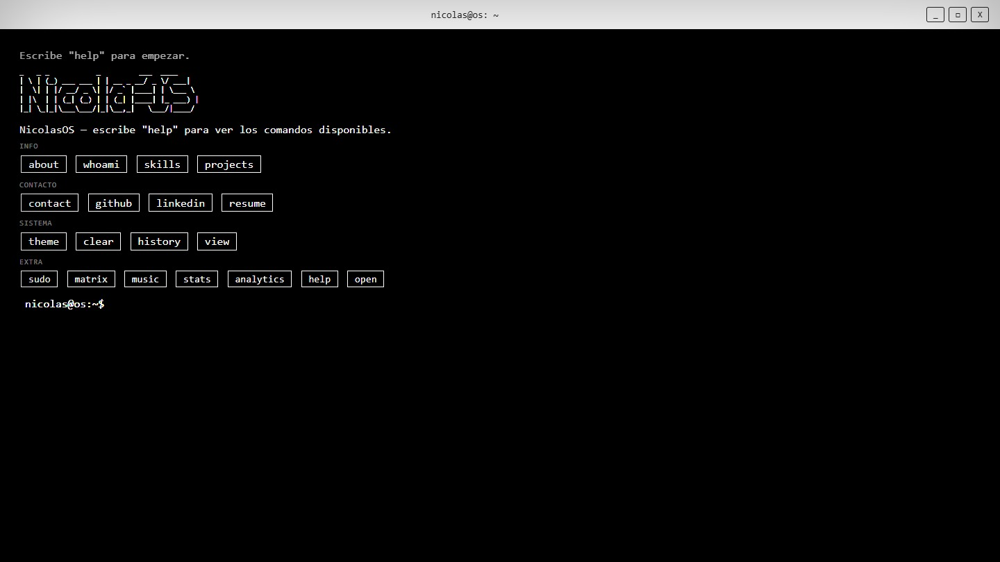
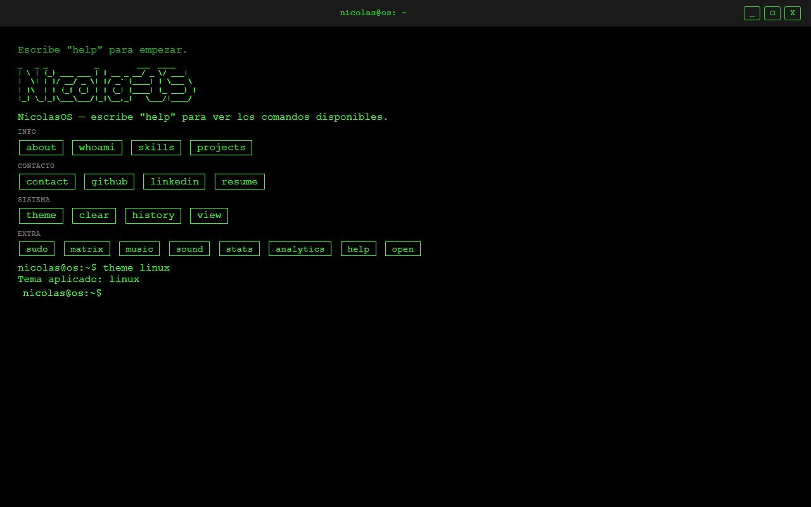
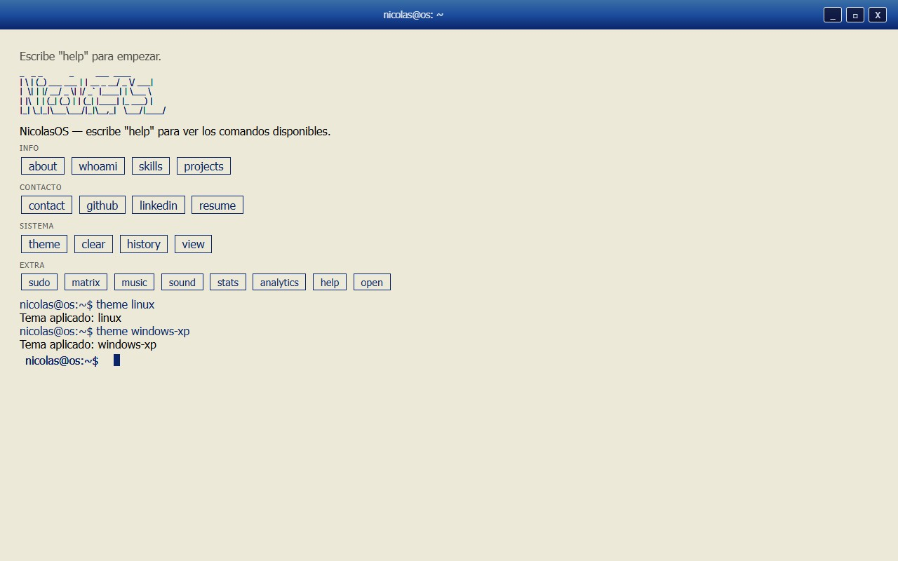
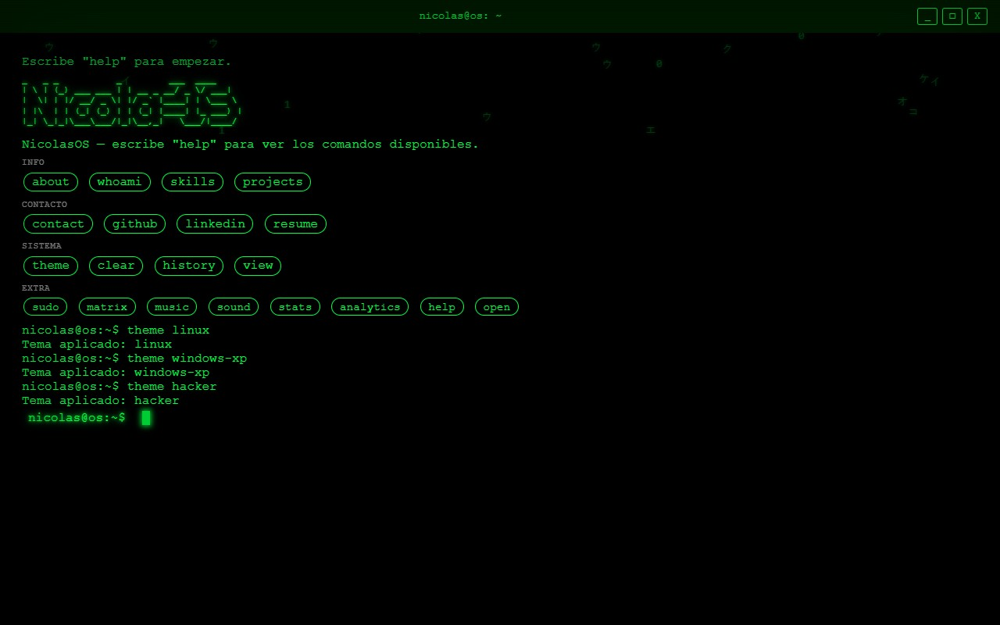
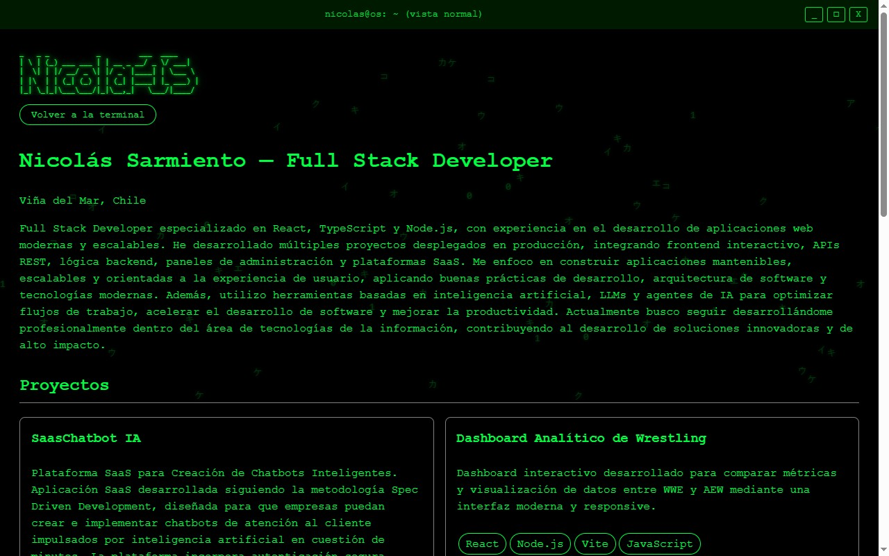

# NicolasOS

Portafolio de **Nicolás Sarmiento** — Full Stack Developer — construido como
un sistema operativo de terminal interactivo. En vez de navegar por
secciones, el visitante escribe (o toca) comandos para descubrir el
contenido: proyectos, skills, experiencia y contacto.

🔗 **Demo:** [ns-dev-five.vercel.app](https://ns-dev-five.vercel.app)




---

## Índice

- [Qué es esto](#qué-es-esto)
- [Capturas](#capturas)
- [Comandos disponibles](#comandos-disponibles)
- [Temas](#temas)
- [Vista normal (modo no técnico)](#vista-normal-modo-no-técnico)
- [Stack técnico](#stack-técnico)
- [Estructura del proyecto](#estructura-del-proyecto)
- [Metodología: Spec-Driven Development](#metodología-spec-driven-development)
- [Subagentes (Claude Code)](#subagentes-claude-code)
- [Skills](#skills)
- [Herramientas MCP y plugins](#herramientas-mcp-y-plugins)
- [Desarrollo local](#desarrollo-local)
- [Testing](#testing)
- [Deploy](#deploy)
- [Estado del proyecto](#estado-del-proyecto)
- [Contacto](#contacto)

---

## Qué es esto

NicolasOS simula un sistema operativo de terminal como portafolio. La idea
central: en vez de scrollear una landing page tradicional, el visitante
interactúa con una línea de comandos real — con historial navegable,
sugerencias ante errores de tipeo, temas visuales intercambiables, y
algunos easter eggs. Para quien no quiera lidiar con la metáfora de
terminal, existe una **vista normal** con el mismo contenido en formato
clásico de portafolio.

Construido con **spec-driven development**: cada feature tiene sus
criterios de aceptación escritos antes de implementarse, y el desarrollo se
organiza por dominios con subagentes especializados de Claude Code (ver
[Metodología](#metodología-spec-driven-development) más abajo).

---

## Capturas

| Terminal (cyberpunk, default) | Tema `linux` |
|---|---|
|  |  |

| Tema `windows-xp` | Tema `hacker` |
|---|---|
|  |  |

**Vista normal** (modo no técnico):



---

## Comandos disponibles

| Comando | Alias ES | Categoría | Descripción |
|---|---|---|---|
| `help` | `ayuda` | info | Lista todos los comandos, con chips tappeables |
| `whoami` | — | info | Identidad rápida (nombre, rol, stack) |
| `about` | — | info | Bio extendida |
| `skills` | — | info | Grid de tecnologías por categoría |
| `projects` | `proyectos` | info | Lista numerada de proyectos |
| `open <n>` | `abrir <n>` | info | Abre el link de demo del proyecto n |
| `contact` | `contacto` | contacto | Email y forma de contacto |
| `github` | — | contacto | Abre GitHub en nueva pestaña |
| `linkedin` | — | contacto | Abre LinkedIn en nueva pestaña |
| `resume` / `cv` | `cv` | contacto | Abre/descarga el CV |
| `theme` | `tema` | sistema | Lista los temas disponibles |
| `theme <n>` | `tema <n>` | sistema | Cambia el tema activo |
| `view` | `vista` | sistema | Alterna entre vista terminal y vista normal |
| `clear` | `limpiar` | sistema | Limpia la pantalla |
| `history` | `historial` | sistema | Comandos usados en la sesión |
| `sudo` | — | extra | Easter egg |
| `matrix` | `matriz` | extra | Animación de lluvia de código a pantalla completa |
| `music` | `musica` | extra | Loop ambiental de audio (opt-in, nunca autoplay) |
| `sound on` / `sound off` | `sonido` | extra | Sonido de tecleo (opt-in, arranca desactivado) |
| `stats` | `estadisticas` | extra | Estadísticas de uso/sesión |
| `analytics on` / `analytics off` | `analitica` | extra | Analítica local de uso (opt-in, sin red, sin cookies) |

Si escribís un comando que no existe, el sistema sugiere el más parecido
("¿quisiste decir `projects`?") en vez de solo tirar error. Hay navegación
de historial con las flechas ↑/↓, y autocompletado con `Tab`: si el
prefijo matchea un solo comando lo completa (`pro` + Tab → `projects`), si
matchea varios lista las opciones en vez de completar a ciegas.

## Temas

| # | Tema | Identidad visual |
|---|---|---|
| 1 | `cyberpunk` | Negro + magenta/cian neón, glow fuerte |
| 2 | `linux` | TTY verde clásico, austero — sin glow, sin scanlines, chips rectos |
| 3 | `dos` | Negro/blanco, cursor de bloque |
| 4 | `windows-xp` | Titlebar azul Luna, controles bevelled 3D auténticos |
| 5 | `hacker` | Verde Matrix saturado, glow marcado, flicker sutil, lluvia de código ambiental de fondo |

Todos los temas comparten la misma barra de título con controles estilo
Windows (`_ □ X`) — minimizar y cerrar son easter eggs sin acción real,
`□` alterna entre vista terminal y vista normal. El comando `theme` sin
argumento muestra, además de la lista, un swatch de color por tema (con
texto alternativo para lectores de pantalla).

## Vista normal (modo no técnico)

Pensada para quien no quiere escribir comandos: mismo contenido (bio,
proyectos con link a demo, skills, contacto), mismo lenguaje visual del
tema activo, mismo ASCII banner — pero en formato de página convencional,
con un botón explícito **"Volver a la terminal"**. Todo el contenido vive
en el DOM desde la carga inicial (no solo generado por JS en runtime), con
meta tags Open Graph para que comparta bien en LinkedIn/WhatsApp/Twitter.

Al cargar el sitio corre primero un boot log corto estilo BIOS/Linux
(`Cargando módulos... OK`, etc.), antes del ASCII banner y el hint de
ayuda — dura 1.5-2.5s y cualquier tecla o click lo saltea directo al
estado final.

---

## Stack técnico

- **Vite + TypeScript** — sin framework, no hace falta para esta escala
- **Vitest** — tests unitarios
- **`@types/node`** — necesario en cuanto cualquier módulo usa `node:fs`/`node:path`
- **Deploy: Vercel** — manejado directamente por el usuario, no por los agentes
- 100% estático, sin backend

## Estructura del proyecto

```
src/
  core/         motor de terminal: parser de input, historial, render
  commands/     un módulo por comando (mismo contrato de entrada/salida)
  themes/       tokens de color/tipografía/efectos por tema
  data/         contenido real: proyectos, skills, experiencia, contacto
  effects/      matrix.ts, music.ts, sound.ts
tests/          un test por módulo de src/
specs/          especificación completa del proyecto, por dominio
.claude/
  agents/       subagentes de Claude Code, uno por dominio
  skills/       skills del proyecto (patrones reutilizables)
.mcp.json       MCP servers committeados al proyecto
CLAUDE.md       contexto que Claude Code carga en cada sesión
AGENTS.md       mismo contenido que CLAUDE.md, formato multi-herramienta
```

---

## Metodología: Spec-Driven Development

Nada se implementa sin estar especificado primero. `specs/` es la fuente
de verdad del proyecto, dividida por dominio:

| Spec | Dominio |
|---|---|
| `00-arquitectura.md` | Visión, stack, estructura, convenciones, tabla dominio→agente |
| `01-onboarding-ux.md` | Boot, descubribilidad, fallback no técnico |
| `02-comandos-core.md` | Parser, historial, cada comando de terminal |
| `03-temas.md` | Sistema de temas y tokens |
| `04-contenido.md` | Datos reales del portafolio |
| `05-seo-fallback.md` | SEO, OG tags, contenido en el DOM |
| `06-effects-v2.md` | Matrix, music, temas extra — completado |
| `07-qa-testing.md` | Estándar de cobertura de tests, transversal |
| `08-seguridad.md` | XSS, links externos, dependencias, transversal |
| `10-diseno-visual.md` | Dirección de arte transversal a temas y onboarding-ux |
| `11-mejoras-interaccion.md` | Autocompletado con Tab, preview de temas, sonidos de teclado, boot extendido — completado |

**Flujo por tarea:** se toma una tarea del spec de su dominio → se delega
al subagente dueño → se implementa → `qa-testing` valida cobertura de
tests y que `npm run build` pase → `seguridad` revisa riesgos → si ambos
aprueban, se propone el mensaje de commit y **el commit/push son
manuales**, los hace el usuario. El desarrollo avanza fase por fase: al
cerrar todas las tareas de un dominio, `orchestrator` se detiene y espera
confirmación antes de arrancar el siguiente.

## Subagentes (Claude Code)

Cada dominio tiene un dueño claro — evita que una tarea llegue a un
subagente sin el alcance correcto para resolverla.

| Agente | Rol |
|---|---|
| `orchestrator` | Punto de entrada para avanzar sin tarea puntual; decide orden, delega, hace cumplir los gates |
| `core-engine` | Motor de terminal y comandos base |
| `content` | Datos reales del portafolio |
| `themes` | Sistema de temas |
| `onboarding-ux` | Boot, chips, fallback no técnico, SEO |
| `diseno-visual` | Dirección de arte — define y revisa, no implementa código |
| `qa-testing` | Valida cobertura de tests y build antes de aprobar un commit |
| `seguridad` | Revisa XSS, links externos, dependencias |
| `devops` | Build, scripts, config para Vercel (sin ejecutar el deploy) |

## Skills

- **`command-pattern`** — firma obligatoria, alias, manejo de errores y
  test pareado para cualquier módulo en `src/commands/`
- **`deploy-to-vercel`** — checklist de pre-deploy (build, tests, audit,
  seguridad); no ejecuta el deploy real, solo prepara y valida

## Herramientas MCP y plugins

Committeadas en `.mcp.json`, se usan activamente en cada etapa correspondiente:

- **Playwright MCP** — verificación visual en navegador real (temas, mobile, chips)
- **Context7 MCP** — documentación actualizada de librerías
- **Vercel MCP** (solo lectura) — logs de build y estado de deployment
- **Ponytail** (plugin de terceros) — minimiza código/tokens en cada turno

No hay MCP de GitHub — el control de versiones es 100% manual.

---

## Desarrollo local

```bash
npm install
npm run dev
```

## Testing

```bash
npm test          # Vitest
npm run build     # confirma que TypeScript y el build de Vite pasan
```

Ambos deben estar en verde antes de cualquier commit — `qa-testing` lo
exige como gate, no es opcional.

## Deploy

Deploy manual en Vercel:

```bash
vercel        # preview
vercel --prod # producción
```

La skill `deploy-to-vercel` corre el checklist de pre-deploy (build, tests,
`npm audit`, revisión de seguridad) pero nunca ejecuta el deploy en sí.

---

## Estado del proyecto

Los dominios `01` a `08` (MVP) y `06-effects-v2` (temas `windows-xp`/
`hacker`, `music`, `matrix`) fueron auditados con evidencia real —
`qa-testing` y `seguridad` corriendo cada criterio de aceptación uno por
uno, no una revisión visual. La auditoría encontró y corrigió:

- Bugs de mobile: posicionamiento del canvas de `matrix` con teclado
  virtual, contraste de labels en `windows-xp`, primer carácter cortado
  en el input.
- `ambientRain.ts` (lluvia de fondo de `hacker`) sin soporte de resize.
- Analítica de comandos guardando datos sin opt-in explícito — ahora
  requiere activación explícita del usuario, mismo patrón que `music`.
- El comando `experience`/`experiencia` se confirmó descartado a
  propósito (no es un gap) y se sacó también del modelo de datos.

`11-mejoras-interaccion.md` (autocompletado con Tab, swatch de temas,
sonido de tecleo opt-in, boot BIOS-style) fue auditado con el mismo rigor
que el MVP y `06-effects-v2` — `qa-testing` y `seguridad` corriendo cada
uno de los 4 criterios de aceptación uno por uno, en dos rondas. La
auditoría encontró y corrigió:

- 1ra ronda: el handler de `Tab` no distinguía match único de prefijo
  ambiguo correctamente.
- 2da ronda: `skipBoot` no usaba el cancelador real de `runBootSequence`,
  dejando timers de tipeo huérfanos corriendo sobre el overlay ya
  desmontado tras saltar el boot.

Los 4 criterios pasan hoy con evidencia real de test. Único hueco no
bloqueante que queda: no hay verificación automatizada (captura
Playwright) de que los 5 colores de los swatches de `theme` sean
visualmente distinguibles entre sí — el `aria-label` por tema sí está
testeado. `npm test` corre 183 tests en verde (38 archivos), `npm run
build` pasa sin errores, y `npm audit` no encontró vulnerabilidades.

No queda ningún ítem pendiente ni bloqueante conocido.

---

## Contacto

**Nicolás Sarmiento** — Full Stack Developer — Viña del Mar, Chile
📧 nicolas.sarmiento.jimenez@gmail.com
